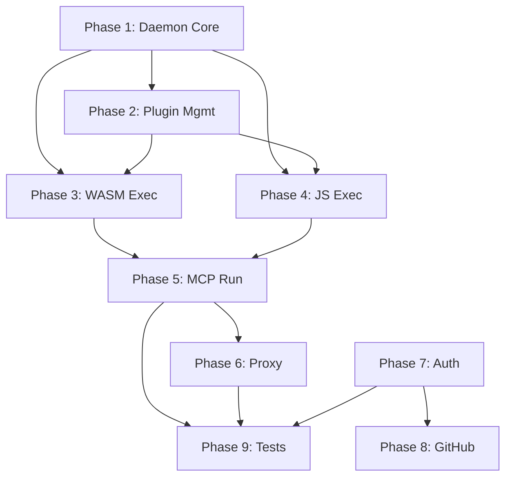

# craft CLI — Phased Implementation Plan

## Current State

The scaffolding is complete: CLI dispatch, [Cargo.toml](file:///Users/e128151/projects/cli/Cargo.toml), config paths, IPC client with nonce handshake, typed IPC protocol, OS keychain wrapper, wasmtime 42 engine + handler, error types with JSON-RPC formatting, and [nonce.rs](file:///Users/e128151/projects/cli/src/daemon/nonce.rs). All of these compile cleanly.

Everything below is **remaining implementation** organized as **Epics** (modules) → **Stories** (deliverable units of work within each epic). Epics are ordered by dependency — earlier epics unblock later ones.

---

## Phase 1 — Daemon Core (unblocks everything)

### Epic 1: [daemon/server.rs](file:///Users/e128151/projects/cli/src/daemon/server.rs) — Accept Loop & Lifecycle

| # | Story | Description |
|---|-------|-------------|
| 1.1 | **Daemon boot sequence** | Acquire `daemon.lock` (flock), write PID, generate nonce, init Engine+Linker, bind Unix socket (0600), enter accept loop |
| 1.2 | **Connection handler** | Per-connection task: read nonce → verify → ACK byte → read `IpcRequest` frame → dispatch to WASM/JS runner or control handler |
| 1.3 | **Graceful shutdown** | SIGTERM handler → stop accepting, drain active connections (5 s timeout), remove PID/lock/socket files |
| 1.4 | **`daemon status`** | Read PID file, probe process, collect stats (uptime, connection count, loaded modules), return `IpcResponse::Status` |
| 1.5 | **`daemon logs`** | Tail `daemon.log` (last 50 lines + follow), integrate `tracing` file appender |

---

## Phase 2 — Plugin Management (unblocks run)

### Epic 2: [mcp/install.rs](file:///Users/e128151/projects/cli/src/mcp/install.rs), [update.rs](file:///Users/e128151/projects/cli/src/mcp/update.rs), [remove.rs](file:///Users/e128151/projects/cli/src/mcp/remove.rs), [list.rs](file:///Users/e128151/projects/cli/src/mcp/list.rs) — Plugin Lifecycle

| # | Story | Description |
|---|-------|-------------|
| 2.1 | **Plugin manifest schema** | Define `PluginManifest` struct in [config.rs](file:///Users/e128151/projects/cli/src/config.rs) (name, kind, source, env_vars, allowed_domains, blake3 hash, wasmtime version) |
| 2.2 | **`mcp install`** | Validate source (WASM magic bytes / JS syntax), copy to `~/.craft/plugins/<name>/`, parse manifest, prompt for credentials (rpassword), store in keychain, write manifest.toml, send `HotReload` IPC if daemon running |
| 2.3 | **`mcp update`** | Re-fetch from registered source, re-validate, replace binary, bump hash, send `HotReload` |
| 2.4 | **`mcp remove`** | Delete plugin dir, send `Evict` IPC to daemon, remove keychain entries |
| 2.5 | **`mcp list`** | Scan `~/.craft/plugins/*/manifest.toml`, print table (name, kind, version, cache status) |

---

## Phase 3 — WASM Execution Path

### Epic 3: [daemon/engine.rs](file:///Users/e128151/projects/cli/src/daemon/engine.rs) + [daemon/handler.rs](file:///Users/e128151/projects/cli/src/daemon/handler.rs) — WASM Plugin Runner

| # | Story | Description |
|---|-------|-------------|
| 3.1 | **AOT compile & cache** | On `HotReload`: compile `.wasm` → `.cwasm` via `engine.precompile_component()`, cache in `~/.craft/cache/` keyed by BLAKE3(source) + wasmtime version |
| 3.2 | **Ephemeral Store creation** | Per-request: build `WasiCtx` (inject credentials as env vars, stdio piped to IPC socket), create `Store<StoreState>` with epoch deadline + ResourceLimiter |
| 3.3 | **Component instantiation & run** | Load `.cwasm` → `Component::deserialize()`, instantiate via Linker, call `_start()`, pipe stdin/stdout through IPC |
| 3.4 | **Epoch timeout enforcement** | Epoch ticker (already scaffolded), configure store deadline = `config.execution.timeout_secs * 10`, trap → `CraftError::Timeout` |

---

## Phase 4 — JS Execution Path

### Epic 4: [daemon/js.rs](file:///Users/e128151/projects/cli/src/daemon/js.rs) + [daemon/network.rs](file:///Users/e128151/projects/cli/src/daemon/network.rs) — rquickjs Runtime

| # | Story | Description |
|---|-------|-------------|
| 4.1 | **[inject_fetch](file:///Users/e128151/projects/cli/src/daemon/network.rs#20-29)** | Register [fetch(url, opts?)](file:///Users/e128151/projects/cli/src/daemon/network.rs#20-29) as async JS global backed by `reqwest`, domain-checked against `allowed_domains` |
| 4.2 | **[inject_websocket](file:///Users/e128151/projects/cli/src/daemon/network.rs#30-37)** | Register `WebSocket` class backed by `tokio-tungstenite`, domain-checked |
| 4.3 | **[inject_process_env](file:///Users/e128151/projects/cli/src/daemon/network.rs#38-45)** | Register `process.env` object, populated with plugin credentials from keychain |
| 4.4 | **[run_js](file:///Users/e128151/projects/cli/src/daemon/js.rs#34-51)** | Load `.js` source, evaluate in fresh `AsyncContext`, pipe stdin/stdout through IPC socket, drop context on completion |

---

## Phase 5 — MCP Run Hot Path

### Epic 5: [mcp/run.rs](file:///Users/e128151/projects/cli/src/mcp/run.rs) — Client-Side stdio Tunnel

| # | Story | Description |
|---|-------|-------------|
| 5.1 | **McpReady handshake** | After sending `RunMcp` frame, read response frame and assert `IpcResponse::McpReady` before piping |
| 5.2 | **Graceful EOF handling** | On stdin EOF, send IPC write shutdown; on IPC EOF, flush stdout and exit 0 |
| 5.3 | **Error mapping** | On `IpcResponse::Error`, map to `CraftError` variant and call [write_jsonrpc_error](file:///Users/e128151/projects/cli/src/error.rs#47-68) |

---

## Phase 6 — Proxy Commands

### Epic 6: `proxy/` — API Proxy Management

| # | Story | Description |
|---|-------|-------------|
| 6.1 | **`proxy start`** | Connect to daemon, send `StartProxy` IPC request, print bound port |
| 6.2 | **`proxy stop`** | Send `StopProxy` IPC request, confirm stopped |
| 6.3 | **`proxy status`** | Send [Status](file:///Users/e128151/projects/cli/src/ipc_proto.rs#80-87) IPC request, print running proxies table |
| 6.4 | **Daemon-side proxy listener** | Bind `127.0.0.1:<port>`, reverse-proxy HTTP requests through WASM/JS plugin |

---

## Phase 7 — Auth Flows

### Epic 7: `auth/` — OAuth & Credential Management

| # | Story | Description |
|---|-------|-------------|
| 7.1 | **GitHub device flow** | Implement [auth/github.rs](file:///Users/e128151/projects/cli/src/auth/github.rs): request device code, poll for token, store in keychain |
| 7.2 | **M365 PKCE flow** | Implement [auth/m365.rs](file:///Users/e128151/projects/cli/src/auth/m365.rs): PKCE auth code flow with `oauth2` crate, store refresh token |
| 7.3 | **Credentials list** | Implement `auth credentials list <plugin>`: enumerate keychain entries for a plugin |

---

## Phase 8 — GitHub Commands

### Epic 8: `github/` — GitHub API via Octocrab

| # | Story | Description |
|---|-------|-------------|
| 8.1 | **`github repos`** | List repos for authenticated user via `octocrab` |
| 8.2 | **`github pulls`** | List/create PRs for a given repo |
| 8.3 | **`github auth`** | Shortcut for `auth github` |

---

## Phase 9 — Testing & Polish

### Epic 9: Cross-cutting Concerns

| # | Story | Description |
|---|-------|-------------|
| 9.1 | **Unit tests** | `nonce::verify`, `ipc_proto::encode`/decode round-trip, `config::Config::load` defaults, `error::rpc_fields` mapping |
| 9.2 | **Integration test** | Spawn daemon, connect, send `RunMcp` for a trivial echo WASM plugin, verify stdout |
| 9.3 | **[js.rs](file:///Users/e128151/projects/cli/src/daemon/js.rs) DaemonState stub fix** | Remove or wire up the `DaemonState` reference in [js.rs](file:///Users/e128151/projects/cli/src/daemon/js.rs) to unblock `--features daemon` clean build |
| 9.4 | **Dead-code cleanup** | Remove unused stubs, address remaining compiler warnings |

---

## Dependency Graph

## Verification Plan

> [!IMPORTANT]
> There are currently **zero tests** in the project. Each phase should add verification as it goes.

### Per-Phase Verification

| Phase | Verification | Command |
|-------|-------------|---------|
| 1 | `cargo check --features daemon` clean build; manual: start daemon, verify PID file created, `craft daemon status` prints info, `craft daemon stop` removes PID | `cargo build --features daemon && ./target/debug/craft daemon start` |
| 2 | `craft mcp install ./test-plugin.wasm` creates `~/.craft/plugins/test-plugin/`; `craft mcp list` shows it; `craft mcp remove test-plugin` cleans up | Manual CLI exercise |
| 3–4 | Integration test: daemon + echo WASM component → stdin "hello" → stdout "hello" | `cargo test --features daemon` (once test written) |
| 5 | `echo '{"jsonrpc":"2.0","method":"ping","id":1}' \| craft mcp run echo-plugin` returns valid JSON-RPC | Manual CLI exercise |
| 6 | `craft proxy start http-echo --port 7401` → `curl localhost:7401` returns response | Manual test |
| 7–8 | `craft auth github` opens device flow; `craft github repos` lists repos | Manual (requires GitHub account) |
| 9 | `cargo test` — all unit tests pass; `cargo check --features daemon` — zero warnings | `cargo test && cargo check --features daemon` |

> [!NOTE]
> Phases 7–8 require real OAuth credentials and can only be verified manually. All other phases can have automated tests.
